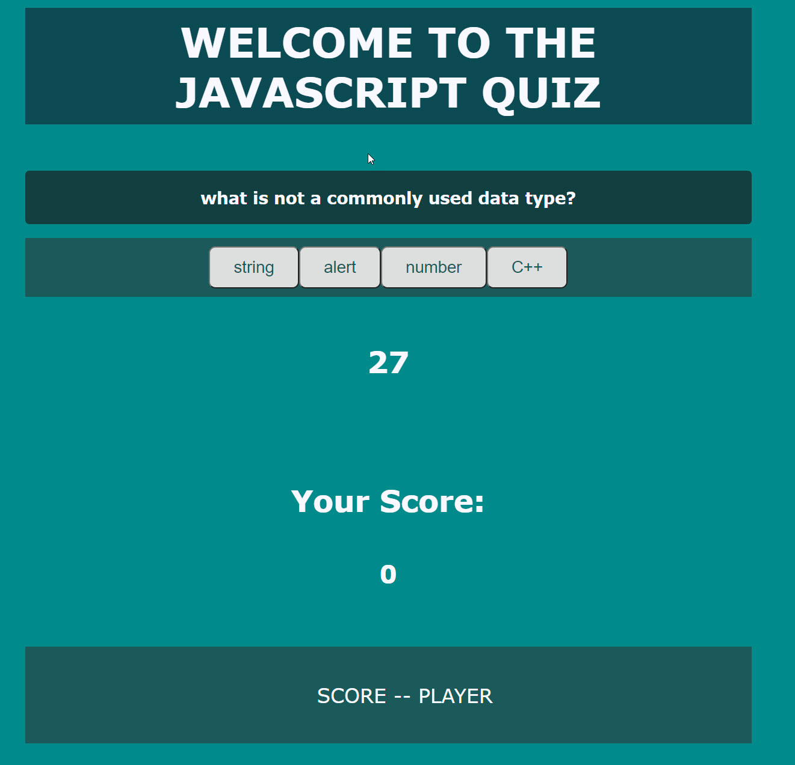

# BootCamp-Homework-Week4

Title: Javascript Quiz
Author: Bobby Schwartz
Description: This is my Coding Bootcamp Week 3 assignment: a Javascript quiz using DOM manipulation and local storage.
created: 1/6/21

##Details
A timed quiz on JavaScript fundamentals that stores high scores. a timed coding quiz with multiple-choice questions. 
This app will run in the browser and will feature dynamic HTML updates.

The page creates an array of objects with qeustions, answers, and a right answer value (A, B, C ,D). Then, four multiple choice buttons are populated with the answer object data.
The question is populated in the question field. The buttons have id's (#A, #B, #C, D) that are used to identify which one was clicked. 
If that clicked button has an id that matches the right answer value, then its marked as correct, and score is iterated plus one. 
Else, timer is subracted 5 seconds of remaining time and no score is added. Next question progresses either way.

GameOver state is reaced when time=0 (either naturally or by wrong answer) or when last question is complete.
Then a prompt lets you enter initials, and logs your currect score and initials to local data.
This appears as an appended list at bottom of page.
an alert asks you to play again, if yes: start function begins again. scoreboard remains, and can be appened further!

##Screenshots

## github page: https://robertschwartz603.github.io/BootCamp-Homework-Week4/